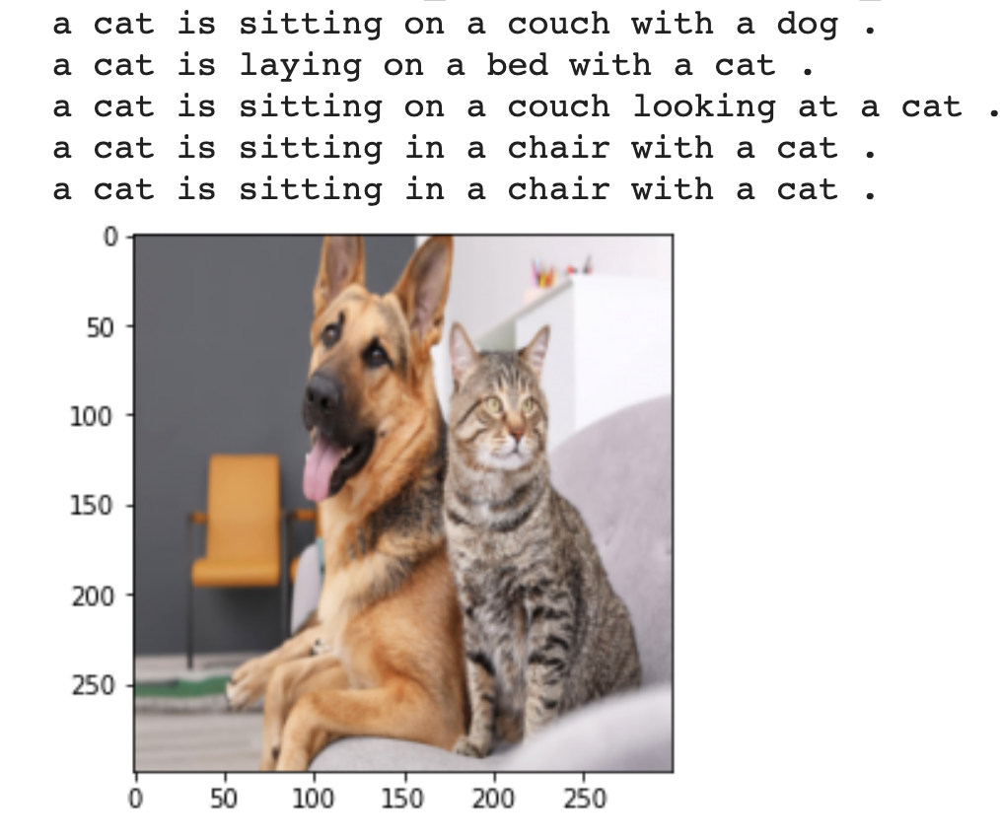

# lsml2_final_Zapolskii

This app implements neural network for image captioning based on idea from: https://ai.googleblog.com/2014/11/a-picture-is-worth-thousand-coherent.html

# Dataset
Training dataset consists from 118287 image codes and  5 text descriptions for each image. 

# Model
Model architecture is based on CNN encoder and RNN decoder:

first we decode image into vector and then generate text using a recurrent 'head' network.  
Loss is crossentropy (neg llh) loss for next captions_ix given previous ones.

After training for 25 epochs, we got train loss: 2.21529, val loss: 2.3989

# Using app:

- Clone repository
- execute from project directory: `run docker build . -t deploy_caption_net`
- launch app by command: docker `run -p 5000:5000 -t -i deploy_caption_net`
- open `http://127.0.0.1:5000/` in your favorite web browser 

  

